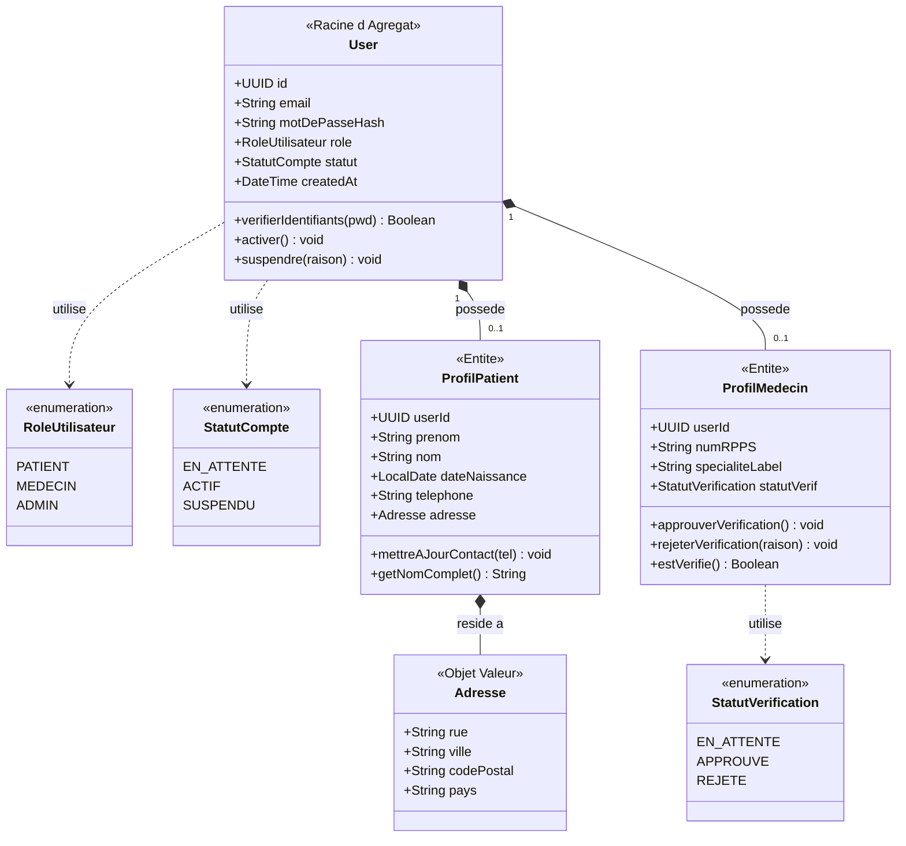
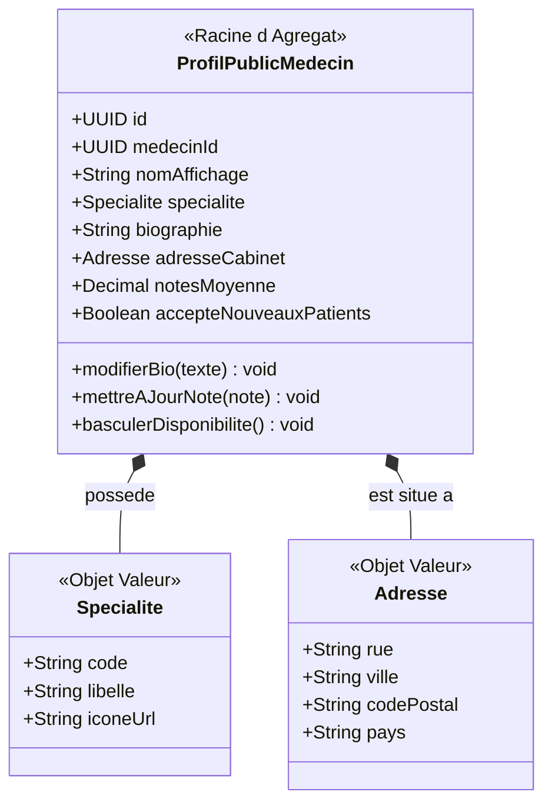
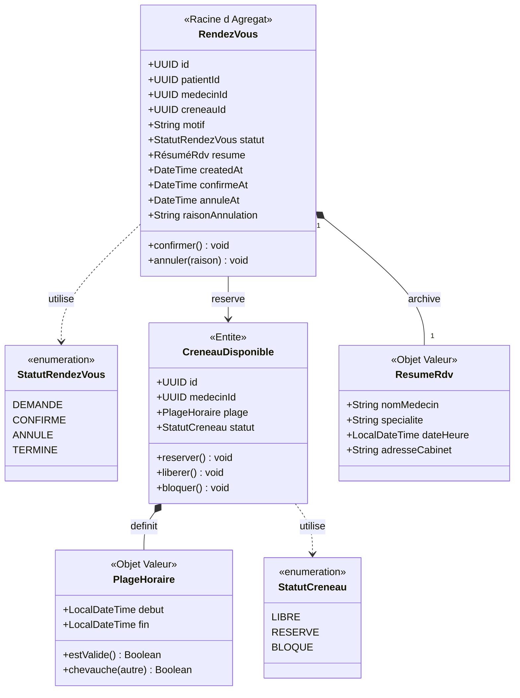
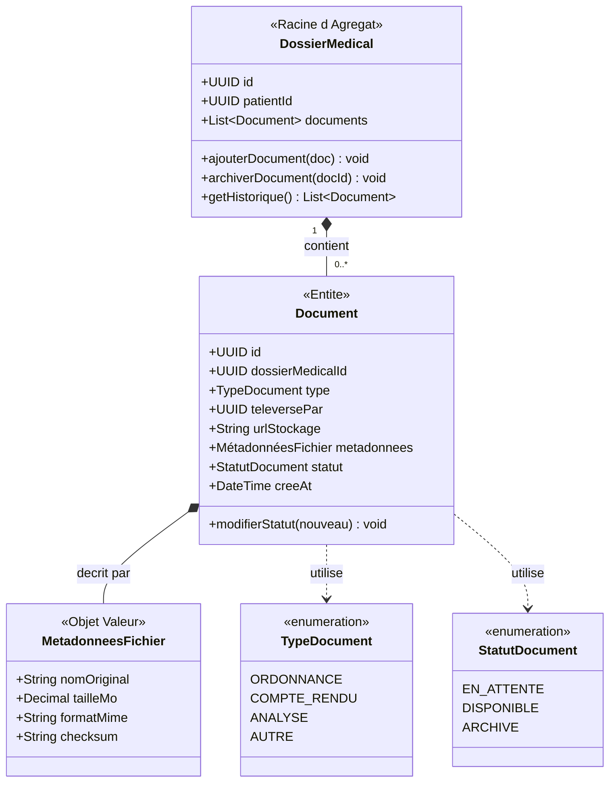

# MediLink — Workflow de Conception (Étapes 1–3)

> **Projet :** MediLink — Application de mise en relation entre patients et médecins pour la prise de rendez-vous en ligne, la gestion des créneaux et le partage sécurisé de documents médicaux.

---

## Table des matières

1. [Étape 1 — Liste brute des fonctionnalités](#étape-1--liste-brute-des-fonctionnalités)
2. [Étape 2 — Regroupement par domaine métier (DDD)](#étape-2--regroupement-par-domaine-métier-ddd)
3. [Étape 3 — Entités métier par module](#étape-3--entités-métier-par-module)
4. [Résumé de conception — Checklist en 4 questions](#résumé-de-conception--checklist-en-4-questions)

---

## Étape 1 — Liste brute des fonctionnalités

> **Méthode :** Liste exhaustive, non triée. Mode « fonctionnel pur » — *ce que* fait l'application, pas *comment* elle est construite. Trois perspectives : Patient, Médecin, et Administrateur système.

### 👤 Patient

- Créer un compte
- Se connecter / Se déconnecter
- Modifier son profil (nom, prénom, date de naissance, téléphone)
- Rechercher un médecin par spécialité, ville ou nom
- Consulter les créneaux disponibles d'un médecin
- Prendre un rendez-vous
- Annuler ou déplacer un rendez-vous
- Recevoir des rappels par notification ou email
- Consulter l'historique des rendez-vous
- Déposer des documents médicaux
- Consulter des ordonnances ou comptes rendus
- Laisser un avis sur le praticien

### 🩺 Médecin

- Créer un compte professionnel (avec numéro RPPS)
- Renseigner sa spécialité
- Définir ses horaires de consultation
- Ouvrir ou fermer des créneaux
- Consulter son agenda du jour
- Accepter ou refuser certaines demandes de rendez-vous
- Consulter le dossier administratif du patient (lors du rendez-vous)
- Déposer une ordonnance
- Déposer un compte rendu
- Suivre l'historique de ses rendez-vous
- Répondre aux avis patients

### 🛡️ Administrateur Système

- Gérer les comptes utilisateurs (patients + médecins)
- Vérifier et approuver les comptes médecins (validation RPPS)
- Suspendre ou bannir un compte
- Modérer les avis
- Superviser la plateforme (statistiques globales)
- Gérer les catégories de spécialités médicales

---

## Étape 2 — Regroupement par domaine métier (DDD)

> **Principe appliqué :** Forte cohésion au sein de chaque module (toutes les fonctionnalités partagent la même raison métier d'évoluer), faible couplage entre les modules (chaque module expose des interfaces propres et ne dépend pas des détails internes d'un autre).

Six **Contextes Bornés** (Bounded Contexts) émergent naturellement :

| # | Module / Contexte Borné | Responsabilité principale | Raison clé de la séparation |
|---|---|---|---|
| 1 | **Identity & Access** | Qui êtes-vous ? Authentification, création de comptes (patient/médecin) et validation des diplômes | La sécurité et le processus de vérification des praticiens sont critiques et isolés |
| 2 | **Medical Directory** | Qu'est-ce qui est disponible ? Recherche et profils publics des médecins (découvrabilité uniquement) | La logique de recherche évolue différemment de la prise de rendez-vous ; ce module ne gère pas les créneaux |
| 3 | **Appointment** | Quand se voit-on ? Gestion des créneaux, réservations, annulations et reports | C'est le cœur du métier avec des règles de collision et de disponibilité complexes |
| 4 | **Health Record** | Quels sont les faits médicaux ? Stockage sécurisé des ordonnances, comptes rendus et documents patients | La gestion des fichiers et la confidentialité médicale (RGPD, secret médical) exigent une infrastructure isolée |
| 5 | **Notification** | Comment informer ? Rappels automatiques, alertes de report et emails de confirmation | Ce module est asynchrone (Event-Driven) et réagit à des événements d'autres modules sans être couplé à eux |
| 6 | **Administration** | Comment va la plateforme ? Modération des avis, statistiques et gouvernance | Les outils d'analyse et de modération sont destinés aux administrateurs, pas aux utilisateurs finaux |

---

### Carte des dépendances entre modules

```
                  ┌───────────────────────┐
                  │   Identity & Access   │
                  └───────────┬───────────┘
                              │ (Token JWT / Rôle : Patient, Médecin, Admin)
          ┌───────────────────┼──────────────────┐
          ▼                   ▼                  ▼
  ┌───────────────┐   ┌───────────────┐  ┌──────────────────┐
  │   Directory   │   │  Appointment  │  │  Administration  │
  └───────┬───────┘   └───────┬───────┘  └──────────────────┘
          │                   │
          │ (ID Médecin)      │ (RdvId → DossierMédicalId)
          └─────────┬─────────┘
                    ▼
          ┌───────────────────┐
          │   Health Record   │
          └───────────────────┘
                    
          ┌──────────────────────────────────────────────────┐
          │  Événements domaine publiés (bus d'événements) : │
          │  RdvConfirmé, RdvAnnulé (Appointment)            │
          │  OrdonnanceDéposée (Health Record)               │
          │  CompteApprouvé (Identity)                       │
          │  AvisModéré (Administration)                     │
          └──────────────────┬───────────────────────────────┘
                             ▼
                   ┌───────────────────┐
                   │   Notification    │
                   └───────────────────┘
```

> **Correction apportée :** Dans la version originale, `Health Record` était placé dans la chaîne de dépendance vers `Notification`, ce qui impliquait que `Notification` dépendait de `Health Record`. La version corrigée place `Notification` en dehors de toute chaîne linéaire : il est un **consommateur d'événements** publié par *tous* les autres modules, pas un dépendant direct de l'un d'eux.

> **Faible couplage garanti :** Les modules de MediLink ne s'importent jamais directement. Ils communiquent via deux mécanismes : (1) des **événements domaine** publiés sur un bus (ex. : `Appointment` publie `RdvConfirmé`, `Notification` écoute) ; (2) des **interfaces exposées** (APIs internes) quand un module a besoin d'une donnée d'un autre. Chaque module reste maître de ses propres données.

---

## Étape 3 — Entités métier par module

> **Vocabulaire :**
> - **Entité** — Possède une identité unique (`id`), est mutable dans le temps (ex : un rendez-vous peut changer de statut)
> - **Objet Valeur (Value Object)** — Pas d'identité propre, immuable, défini entièrement par ses valeurs (ex : une adresse, un créneau horaire)
> - **Racine d'Agrégat** — Le "chef" d'un groupe d'entités liées ; les autres modules n'interagissent qu'avec lui via son `id`, jamais directement avec ses entités enfants

---

### Module 1 — `Identity & Access`

**Rôle :** Gérer qui peut se connecter et avec quels droits. C'est le gardien de la plateforme.

#### Racine d'Agrégat : `User`

| Attribut | Type | Pourquoi il existe |
|---|---|---|
| `id` | UUID | Identifiant unique généré par le système |
| `email` | String | Identifiant de connexion |
| `motDePasseHash` | String | Sécurité (jamais stocké en clair) |
| `role` | Enum : `PATIENT, MEDECIN, ADMIN` | Contrôle des droits d'accès |
| `statut` | Enum : `EN_ATTENTE, ACTIF, SUSPENDU` | Cycle de vie du compte |
| `createdAt` | DateTime | Traçabilité |

#### Entité : `ProfilPatient` *(appartient à User)*

| Attribut | Type | Pourquoi il existe |
|---|---|---|
| `userId` | UUID | Lien vers le `User` parent |
| `prénom` | String | Identification civile |
| `nom` | String | Identification civile |
| `dateNaissance` | LocalDate | Informations médicales de base |
| `téléphone` | String | Contact et notifications SMS |
| `adresse` | Adresse | Objet Valeur : lieu de résidence |

#### Entité : `ProfilMédecin` *(appartient à User)*

| Attribut | Type | Pourquoi il existe |
|---|---|---|
| `userId` | UUID | Lien vers le `User` parent |
| `numRPPS` | String | Numéro officiel de praticien (vérification légale) |
| `spécialitéLabel` | String | Label de spécialité (simple, sans FK vers Directory) |
| `statutVérification` | Enum : `EN_ATTENTE, APPROUVÉ, REJETÉ` | Processus de validation admin |

> **Correction apportée :** La version originale contenait `spécialitéId` (UUID) dans `ProfilMédecin`, créant une dépendance de `Identity` vers `Directory`. Cela viole le principe de faible couplage — `Identity` n'a pas à connaître la structure interne de `Directory`. La correction remplace cette FK par un simple `spécialitéLabel` (String). Le module `Directory` maintient sa propre liste de spécialités de façon autonome.

#### Objet Valeur : `Adresse`

| Attribut | Type |
|---|---|
| `rue` | String |
| `ville` | String |
| `codePostal` | String |
| `pays` | String |

> **Pourquoi `Adresse` est un Objet Valeur ?** Une adresse n'a pas d'identité propre — deux médecins peuvent partager la même adresse de cabinet sans que ce soit le "même objet". Si l'adresse change, on la remplace entièrement ; on ne la "met pas à jour".

#### Diagramme de Classes — Identity & Access



> **Correction apportée :** La version originale utilisait `--|>` (héritage/extension) pour relier `ProfilPatient` et `ProfilMédecin` à `User`. C'est une erreur de modélisation DDD. `ProfilPatient` n'*est pas* un `User` — il *appartient* à un `User`. La relation correcte est une **composition** (`*--`) : le profil fait partie de l'agrégat `User` et ne peut exister sans lui.

---

### Module 2 — `Medical Directory`

**Rôle :** Le catalogue public des médecins. C'est ce que voit un patient quand il cherche un praticien. Ce module gère uniquement la **découvrabilité** — il ne gère pas les créneaux (c'est `Appointment`) et n'accède pas aux dossiers médicaux.

#### Racine d'Agrégat : `ProfilPublicMédecin`

| Attribut | Type | Pourquoi il existe |
|---|---|---|
| `id` | UUID | Identifiant unique |
| `médecinId` | UUID | Référence vers `Identity` (jamais les données complètes) |
| `nomAffichage` | String | Nom visible dans les résultats de recherche |
| `spécialité` | Spécialité | Objet Valeur décrivant la discipline médicale |
| `biographie` | String | Présentation libre du praticien |
| `adresseCabinet` | Adresse | Localisation pour la recherche géographique |
| `notesMoyenne` | Decimal | Dénormalisée, mise à jour via événement `AvisPublié` depuis Administration |
| `accepteNouveauxPatients` | Boolean | Fonctionnalité : ouvrir/fermer les réservations |

> **Correction apportée :** `notesMoyenne` ne doit pas être calculée à la volée depuis `Administration`. Elle est une donnée **dénormalisée** : `Administration` publie un événement `AvisPublié` (avec la nouvelle note), et `Directory` met à jour sa propre copie. Ainsi, les deux modules restent indépendants.

> **Correction apportée :** `CréneauDisponible` a été retiré de ce module. Un créneau est une ressource réservable avec un cycle de vie (LIBRE → RÉSERVÉ → BLOQUÉ) — il appartient au module `Appointment` qui gère toute la logique de réservation et d'anti-collision. `Directory` se contente d'afficher si le médecin *accepte des patients*, sans gérer les créneaux individuels.

#### Objet Valeur : `Spécialité`

| Attribut | Type |
|---|---|
| `code` | String (ex. : `CARDIO`) |
| `libellé` | String (ex. : `Cardiologie`) |
| `icôneUrl` | String |

> **Pourquoi `Spécialité` est un Objet Valeur ?** Une spécialité est définie par ses attributs (`CARDIO` / `Cardiologie`), pas par un identifiant. Deux profils ayant la même spécialité partagent exactement la même valeur — il n'y a pas de "Cardiologie de l'objet #42" différente d'une autre.

#### Objet Valeur : `Adresse` *(réutilisé depuis Identity & Access)*

Même structure que dans `Identity & Access`. Chaque module conserve sa propre copie — pas de partage de classe entre modules (faible couplage).

#### Diagramme de Classes — Medical Directory



---

### Module 3 — `Appointment`

**Rôle :** Le cœur du métier. Gérer le cycle de vie complet d'un rendez-vous (de la demande à la réalisation) et les créneaux de disponibilité des médecins. C'est ici que se trouvent les règles métier les plus complexes : anti-collision de créneaux, règles d'annulation, transitions d'état.

#### Racine d'Agrégat : `RendezVous`

| Attribut | Type | Pourquoi il existe |
|---|---|---|
| `id` | UUID | Identifiant unique |
| `patientId` | UUID | Référence vers `Identity` |
| `médecinId` | UUID | Référence vers `Identity` |
| `créneauId` | UUID | Référence vers `CréneauDisponible` (dans ce même module) |
| `motif` | String | Raison de la consultation |
| `statut` | Enum : `DEMANDÉ, CONFIRMÉ, ANNULÉ, TERMINÉ` | Cycle de vie |
| `résumé` | RésuméRdv | Snapshot immuable capturé à la confirmation |
| `createdAt` | DateTime | Traçabilité |
| `confirméAt` | DateTime (nullable) | Horodatage de confirmation |
| `annuléAt` | DateTime (nullable) | Horodatage d'annulation |
| `raisonAnnulation` | String (nullable) | Traçabilité et statistiques |

> **Règle métier clé :** Quand un `RendezVous` passe au statut `CONFIRMÉ`, le module publie un événement domaine `RdvConfirmé`. `Notification` captera cet événement pour envoyer l'email de confirmation. Le module `Appointment` ne sait pas et ne doit pas savoir comment fonctionne l'envoi d'email.

#### Entité : `CréneauDisponible` *(appartient à l'agrégat `RendezVous` via le médecin)*

| Attribut | Type | Pourquoi il existe |
|---|---|---|
| `id` | UUID | Identifiant unique |
| `médecinId` | UUID | Lien vers le médecin propriétaire |
| `plage` | PlageHoraire | Objet Valeur : début + fin |
| `statut` | Enum : `LIBRE, RÉSERVÉ, BLOQUÉ` | Gestion de la disponibilité |

> **Correction apportée :** `CréneauDisponible` a été déplacé de `Medical Directory` vers `Appointment`. La raison : un créneau est une ressource réservable avec des règles métier complexes (anti-collision, transition d'état). Gérer ces règles dans `Directory`, dont le rôle est la *découvrabilité*, violerait le Principe de Responsabilité Unique (SRP).

#### Objet Valeur : `RésuméRdv` *(snapshot immuable)*

| Attribut | Type |
|---|---|
| `nomMédecin` | String |
| `spécialité` | String |
| `dateHeure` | LocalDateTime |
| `adresseCabinet` | String |

#### Objet Valeur : `PlageHoraire`

| Attribut | Type |
|---|---|
| `début` | LocalDateTime |
| `fin` | LocalDateTime |

> **Pourquoi `PlageHoraire` est un Objet Valeur ?** Un créneau de 9h à 9h30 ne change pas d'identité — si on le modifie, on en crée un nouveau. Cela empêche les bugs de modification involontaire de l'horaire d'un rendez-vous déjà confirmé.

#### Diagramme de Classes — Appointment



> **Pourquoi un snapshot ?** Au moment où le patient consulte son historique, le médecin a peut-être changé de cabinet. Le `RésuméRdv` capture les informations **au moment de la réservation**, comme une photo figée dans le temps. C'est le **patron Snapshot Immuable**.

---

### Module 4 — `Health Record`

**Rôle :** Le coffre-fort médical. Stocker de façon sécurisée les documents échangés entre patient et médecin. Ce module est régi par des contraintes de confidentialité (RGPD, secret médical) — c'est pourquoi il est rigoureusement isolé de tous les autres.

#### Racine d'Agrégat : `DossierMédical`

| Attribut | Type | Pourquoi il existe |
|---|---|---|
| `id` | UUID | Identifiant unique |
| `patientId` | UUID | Propriétaire du dossier (référence vers `Identity`) |
| `documents` | List\<Document\> | Collection de tous les fichiers du patient |

#### Entité : `Document` *(appartient à `DossierMédical`)*

| Attribut | Type | Pourquoi il existe |
|---|---|---|
| `id` | UUID | Identifiant unique |
| `dossierMédicalId` | UUID | Lien vers le dossier parent |
| `type` | Enum : `ORDONNANCE, COMPTE_RENDU, ANALYSE, AUTRE` | Catégorisation |
| `téléversePar` | UUID | ID du médecin ou patient auteur |
| `urlStockage` | String | Chemin sécurisé vers le fichier (S3, Azure Blob…) |
| `métadonnées` | MétadonnéesFichier | Objet Valeur : informations techniques du fichier |
| `statut` | Enum : `EN_ATTENTE, DISPONIBLE, ARCHIVÉ` | Cycle de vie |
| `createdAt` | DateTime | Traçabilité et tri chronologique |

#### Objet Valeur : `MétadonnéesFichier`

| Attribut | Type |
|---|---|
| `nomOriginal` | String |
| `tailleMo` | Decimal |
| `formatMime` | String (ex. : `application/pdf`) |
| `checksum` | String (SHA-256) |

> **Pourquoi `MétadonnéesFichier` est un Objet Valeur ?** Ces informations décrivent le fichier tel qu'il était au moment du dépôt — elles ne changent jamais. Si le fichier est remplacé, c'est un nouveau `Document` qui est créé, pas une modification de l'ancien. Cela garantit l'intégrité de l'historique médical.

#### Diagramme de Classes — Health Record



---

### Module 5 — `Notification`

**Rôle :** Ce module ne contient aucune entité métier au sens DDD — il est **purement réactif**. Il s'abonne aux événements domaine émis par les autres modules et les convertit en communications (email, SMS, push).

#### Entité : `JournalNotification` *(piste d'audit)*

| Attribut | Type | Pourquoi il existe |
|---|---|---|
| `id` | UUID | Identifiant unique |
| `destinataireId` | UUID | Référence vers l'utilisateur cible |
| `canal` | Enum : `EMAIL, SMS, PUSH` | Canal de communication choisi |
| `type` | Enum : `RDV_CONFIRMÉ, RDV_ANNULÉ, RAPPEL_RDV, DOCUMENT_DISPONIBLE, COMPTE_APPROUVÉ` | Type d'événement ayant déclenché la notif |
| `contenu` | JSON | Données de l'événement (sérialisées) |
| `envoyéAt` | DateTime | Horodatage d'envoi |
| `statut` | Enum : `ENVOYÉ, ÉCHEC, IGNORÉ` | Résultat de la livraison |

#### Événements domaine consommés (depuis les autres modules)

| Événement | Émis par | Action |
|---|---|---|
| `RdvConfirmé` | Appointment | Notifier le patient (confirmation) + le médecin (agenda mis à jour) |
| `RdvAnnulé` | Appointment | Notifier le patient et le médecin |
| `RappelRdvProche` | Appointment (tâche planifiée) | Envoyer un rappel 24h avant au patient |
| `OrdonnanceDéposée` | Health Record | Notifier le patient qu'un document est disponible |
| `CompteApprouvé` | Identity & Access | Notifier le médecin de l'activation de son compte |
| `AvisModéré` | Administration | Notifier le patient concerné |

---

### Module 6 — `Administration`

**Rôle :** Gouvernance, modération et supervision de la plateforme. Ces fonctionnalités sont réservées aux administrateurs et évoluent au rythme de la politique interne, indépendamment des fonctionnalités produit.

#### Entité : `Avis`

| Attribut | Type | Pourquoi il existe |
|---|---|---|
| `id` | UUID | Identifiant unique |
| `patientId` | UUID | Auteur de l'avis |
| `médecinId` | UUID | Médecin évalué |
| `rendezVousId` | UUID | Lien vers le rendez-vous concerné (preuve de consultation) |
| `note` | Integer (1–5) | Note attribuée |
| `commentaire` | String | Texte libre |
| `répondreParMédecin` | String (nullable) | Réponse du praticien |
| `statut` | Enum : `VISIBLE, SIGNALÉ, SUPPRIMÉ` | Modération |
| `createdAt` | DateTime | Traçabilité |

#### Entité : `RapportModération`

| Attribut | Type | Pourquoi il existe |
|---|---|---|
| `id` | UUID | Identifiant unique |
| `signaléPar` | UUID | Référence vers l'utilisateur |
| `cibleType` | Enum : `AVIS, PROFIL` | Type de contenu signalé |
| `cibleId` | UUID | Identifiant de l'entité signalée |
| `raison` | String | Motif du signalement |
| `statut` | Enum : `EN_ATTENTE, EXAMINÉ, TRAITÉ` | Suivi admin |

---

## Résumé de conception — Checklist en 4 questions

| Module | Quel module ? | Quelles données ? | Quelle logique ? | Quelle interaction ? |
|---|---|---|---|---|
| Identity & Access | Cycle de vie des comptes | User, ProfilPatient, ProfilMédecin | Hachage mdp, attribution de rôle, flux de vérification RPPS | REST (POST /register, POST /login), tableau de bord Admin |
| Medical Directory | Découvrabilité des médecins | ProfilPublicMédecin, Spécialité | Recherche géographique, filtres, calcul de note (via événement) | REST (GET /medecins, GET /medecins?specialite=CARDIO) |
| Appointment | Réservation et créneaux | RendezVous, CréneauDisponible | Anti-collision, transitions d'état, règles d'annulation | REST (POST /rdv, PATCH /rdv/{id}/annuler), Cron (rappels) |
| Health Record | Dossier médical | DossierMédical, Document | Contrôle d'accès (RGPD), intégrité via checksum | REST sécurisé (POST /documents, GET /dossier/{patientId}) |
| Notification | Communication | JournalNotification | Routage par canal, filtrage des préférences | Écouteur d'événements (Kafka / Observer), API Email/SMS/Push |
| Administration | Gouvernance | Avis, RapportModération | Modération, validation des signalements | API REST Admin, tableau de bord interne |

---

*Document produit dans le cadre du projet MediLink — Workflow de Conception Étapes 1–3.*
*Prochaine étape : Étape 4 — Dérivation des composants techniques et rédaction des ADR.*
