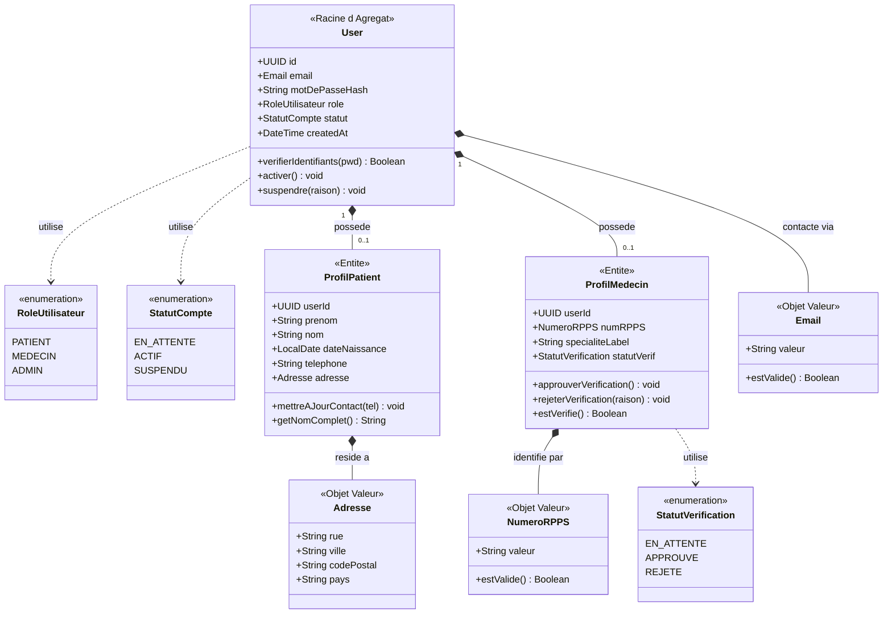
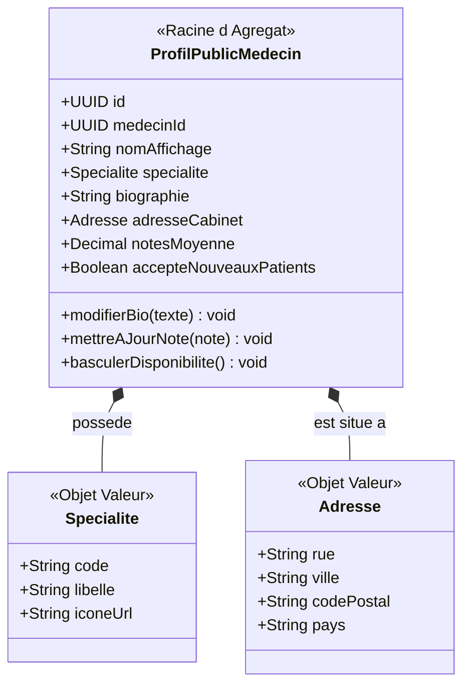
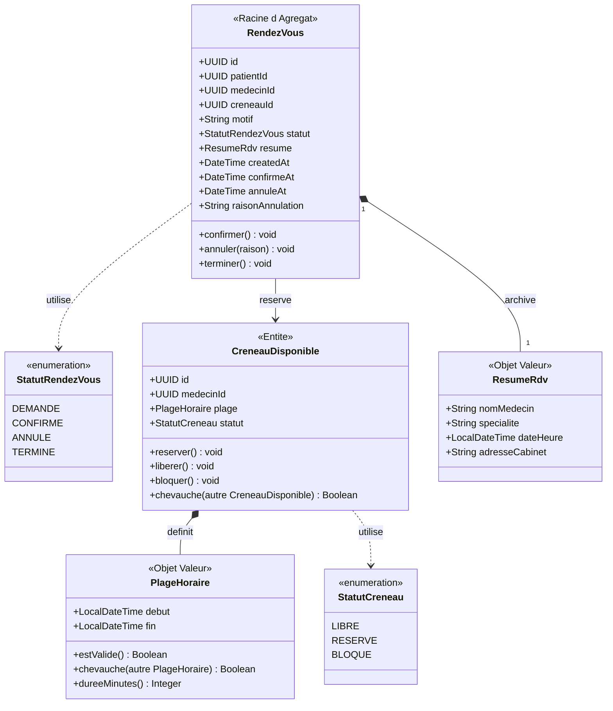
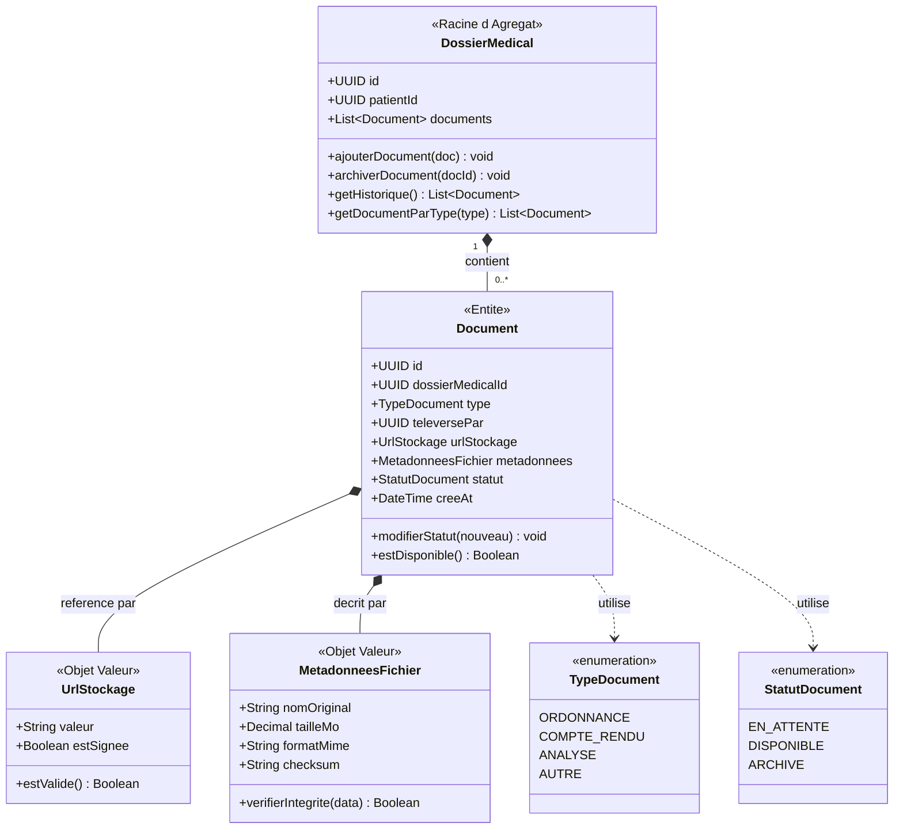
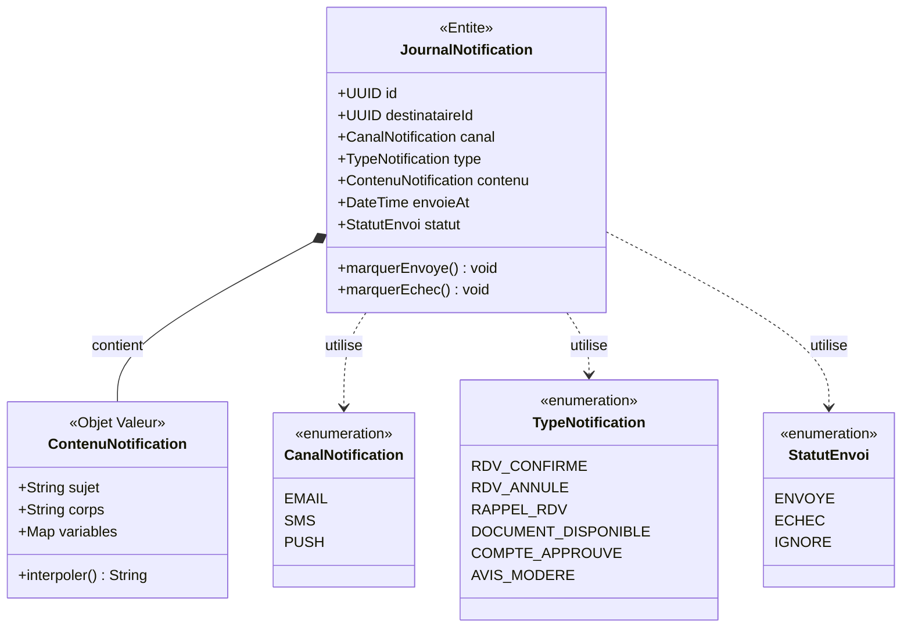
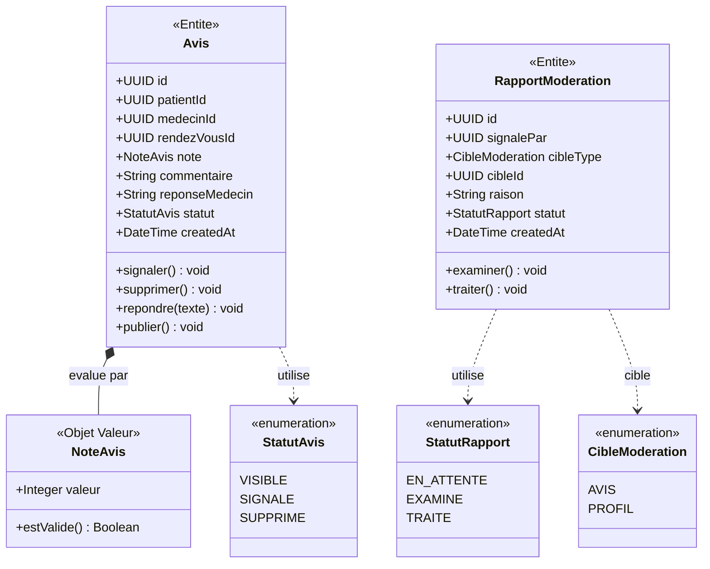
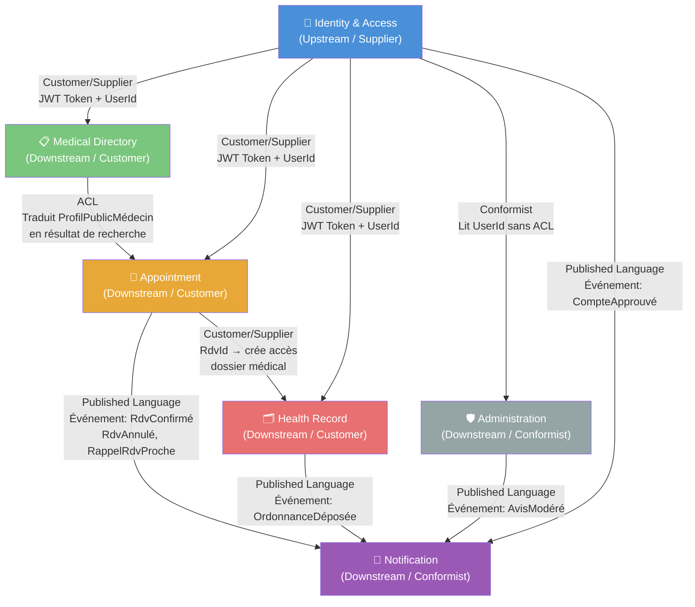
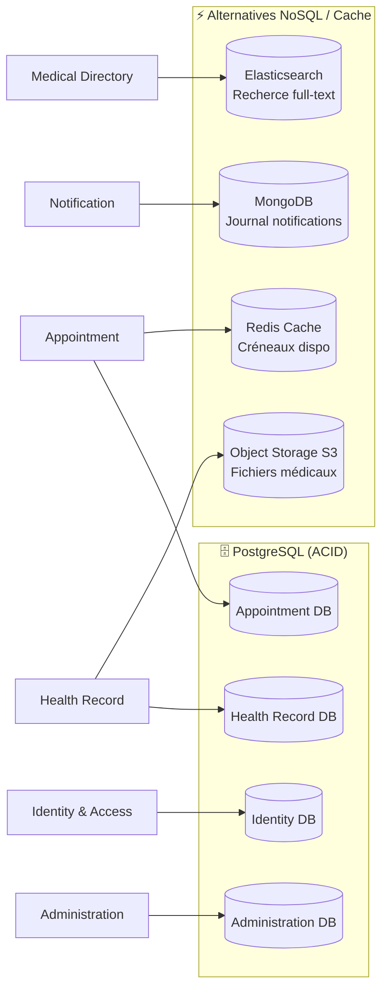

# MediLink — Workflow de Conception

> **Projet :** MediLink — Application de mise en relation entre patients et médecins pour la prise de rendez-vous en ligne, la gestion des créneaux et le partage sécurisé de documents médicaux.

---

## Table des matières

1. [Étape 1 — Liste brute des fonctionnalités](#étape-1--liste-brute-des-fonctionnalités)
2. [Étape 2 — Regroupement par domaine métier (DDD)](#étape-2--regroupement-par-domaine-métier-ddd)
3. [Étape 3 — Entités métier par module](#étape-3--entités-métier-par-module)
4. [Étape 4 — Context Mapping (Relations entre Bounded Contexts)](#étape-4--context-mapping-relations-entre-bounded-contexts)
5. [Étape 5 — Architecture & Stratégie de Persistance](#étape-5--architecture--stratégie-de-persistance)
6. [Étape 6 — ADR (Architecture Decision Records)](#étape-6--adr-architecture-decision-records)

---

## Étape 1 — Liste brute des fonctionnalités

> **Méthode :** Liste exhaustive, non triée. Mode « fonctionnel pur » — *ce que* fait l'application, pas *comment* elle est construite. Trois perspectives : Patient, Médecin, et Administrateur système.

### 👤 Patient

- Créer un compte
- Se connecter / Se déconnecter
- Modifier son profil (nom, prénom, date de naissance, téléphone)
- Rechercher un médecin par spécialité, ville ou nom
- Consulter les créneaux disponibles d'un médecin
- Prendre un rendez-vous
- Annuler ou déplacer un rendez-vous
- Recevoir des rappels par notification ou email
- Consulter l'historique des rendez-vous
- Déposer des documents médicaux
- Consulter des ordonnances ou comptes rendus
- Laisser un avis sur le praticien

### 🩺 Médecin

- Créer un compte professionnel (avec numéro RPPS)
- Renseigner sa spécialité
- Définir ses horaires de consultation
- Ouvrir ou fermer des créneaux
- Consulter son agenda du jour
- Accepter ou refuser certaines demandes de rendez-vous
- Consulter le dossier administratif du patient (lors du rendez-vous)
- Déposer une ordonnance
- Déposer un compte rendu
- Suivre l'historique de ses rendez-vous
- Répondre aux avis patients

### 🛡️ Administrateur Système

- Gérer les comptes utilisateurs (patients + médecins)
- Vérifier et approuver les comptes médecins (validation RPPS)
- Suspendre ou bannir un compte
- Modérer les avis
- Superviser la plateforme (statistiques globales)
- Gérer les catégories de spécialités médicales

---

## Étape 2 — Regroupement par domaine métier (DDD)

> **Principe appliqué :** Forte cohésion au sein de chaque module (toutes les fonctionnalités partagent la même raison métier d'évoluer), faible couplage entre les modules (chaque module expose des interfaces propres et ne dépend pas des détails internes d'un autre).

Six **Contextes Bornés** (Bounded Contexts) émergent naturellement :

| # | Module / Contexte Borné | Responsabilité principale | Raison clé de la séparation |
|---|---|---|---|
| 1 | **Identity & Access** | Qui êtes-vous ? Authentification, création de comptes (patient/médecin) et validation des diplômes | La sécurité et le processus de vérification des praticiens sont critiques et isolés |
| 2 | **Medical Directory** | Qu'est-ce qui est disponible ? Recherche et profils publics des médecins (découvrabilité uniquement) | La logique de recherche évolue différemment de la prise de rendez-vous ; ce module ne gère pas les créneaux |
| 3 | **Appointment** | Quand se voit-on ? Gestion des créneaux, réservations, annulations et reports | C'est le cœur du métier avec des règles de collision et de disponibilité complexes |
| 4 | **Health Record** | Quels sont les faits médicaux ? Stockage sécurisé des ordonnances, comptes rendus et documents patients | La gestion des fichiers et la confidentialité médicale (RGPD, secret médical) exigent une infrastructure isolée |
| 5 | **Notification** | Comment informer ? Rappels automatiques, alertes de report et emails de confirmation | Ce module est asynchrone (Event-Driven) et réagit à des événements d'autres modules sans être couplé à eux |
| 6 | **Administration** | Comment va la plateforme ? Modération des avis, statistiques et gouvernance | Les outils d'analyse et de modération sont destinés aux administrateurs, pas aux utilisateurs finaux |

---

### Carte des dépendances entre modules

```
                  ┌───────────────────────┐
                  │   Identity & Access   │
                  └───────────┬───────────┘
                              │ (Token JWT / Rôle : Patient, Médecin, Admin)
          ┌───────────────────┼──────────────────┐
          ▼                   ▼                  ▼
  ┌───────────────┐   ┌───────────────┐  ┌──────────────────┐
  │   Directory   │   │  Appointment  │  │  Administration  │
  └───────┬───────┘   └───────┬───────┘  └──────────────────┘
          │                   │
          │ (ID Médecin)      │ (RdvId → DossierMédicalId)
          └─────────┬─────────┘
                    ▼
          ┌───────────────────┐
          │   Health Record   │
          └───────────────────┘
                    
          ┌──────────────────────────────────────────────────┐
          │  Événements domaine publiés (bus d'événements) : │
          │  RdvConfirmé, RdvAnnulé (Appointment)            │
          │  OrdonnanceDéposée (Health Record)               │
          │  CompteApprouvé (Identity)                       │
          │  AvisModéré (Administration)                     │
          └──────────────────┬───────────────────────────────┘
                             ▼
                   ┌───────────────────┐
                   │   Notification    │
                   └───────────────────┘
```

> **Faible couplage garanti :** Les modules de MediLink ne s'importent jamais directement. Ils communiquent via deux mécanismes :
> - Des **événements domaine** publiés sur un bus (ex. : `Appointment` publie `RdvConfirmé`, `Notification` écoute) ;
> - Des **interfaces exposées** (APIs internes) quand un module a besoin d'une donnée d'un autre. Chaque module reste maître de ses propres données.

---

## Étape 3 — Entités métier par module

> **Vocabulaire :**
> - **Entité** — Possède une identité unique (`id`), est mutable dans le temps 
> - **Objet Valeur (Value Object)** — Pas d'identité propre, immuable, défini entièrement par ses valeurs 
> - **Racine d'Agrégat** — Le "chef" d'un groupe d'entités liées ; les autres modules n'interagissent qu'avec lui via son `id`, jamais directement avec ses entités enfants

---

### Module 1 — `Identity & Access`

**Rôle :** Gérer qui peut se connecter et avec quels droits. C'est le gardien de la plateforme.

#### Racine d'Agrégat : `User`

| Attribut | Type | Pourquoi il existe |
|---|---|---|
| `id` | UUID | Identifiant unique généré par le système |
| `email` | Email *(VO)* | Identifiant de connexion — traité comme Objet Valeur (format validé, immuable après vérification) |
| `motDePasseHash` | String | Sécurité (jamais stocké en clair) |
| `role` | Enum : `PATIENT, MEDECIN, ADMIN` | Contrôle des droits d'accès |
| `statut` | Enum : `EN_ATTENTE, ACTIF, SUSPENDU` | Cycle de vie du compte |
| `createdAt` | DateTime | Traçabilité |

> **Correction DDD :** `email` est promu en Objet Valeur `Email` (valide sa structure à la construction, immuable) plutôt qu'un simple `String`.

#### Entité : `ProfilPatient` *(appartient à User)*

| Attribut | Type | Pourquoi il existe |
|---|---|---|
| `userId` | UUID | Lien vers le `User` parent |
| `prénom` | String | Identification civile |
| `nom` | String | Identification civile |
| `dateNaissance` | LocalDate | Informations médicales de base |
| `téléphone` | String | Contact et notifications SMS |
| `adresse` | Adresse *(VO)* | Objet Valeur : lieu de résidence |

#### Entité : `ProfilMédecin` *(appartient à User)*

| Attribut | Type | Pourquoi il existe |
|---|---|---|
| `userId` | UUID | Lien vers le `User` parent |
| `numRPPS` | NuméroRPPS *(VO)* | Numéro officiel de praticien — Objet Valeur (format réglementé, immuable) |
| `spécialitéLabel` | String | Label de spécialité (simple, sans FK vers Directory) |
| `statutVérification` | Enum : `EN_ATTENTE, APPROUVÉ, REJETÉ` | Processus de validation admin |

> **Correction DDD :** `numRPPS` promu en Objet Valeur `NuméroRPPS` — il encapsule sa règle de validation (11 chiffres, format réglementé) et est immuable une fois assigné.

#### Objet Valeur : `Email`

| Attribut | Type |
|---|---|
| `valeur` | String (format RFC 5322 validé) |

#### Objet Valeur : `NuméroRPPS`

| Attribut | Type |
|---|---|
| `valeur` | String (11 chiffres, validé à la construction) |

#### Objet Valeur : `Adresse`

| Attribut | Type |
|---|---|
| `rue` | String |
| `ville` | String |
| `codePostal` | String |
| `pays` | String |

#### Diagramme de Classes — Identity & Access



---

### Module 2 — `Medical Directory`

**Rôle :** Le catalogue public des médecins. C'est ce que voit un patient quand il cherche un praticien. Ce module gère uniquement la **découvrabilité** — il ne gère pas les créneaux (c'est `Appointment`) et n'accède pas aux dossiers médicaux.

#### Racine d'Agrégat : `ProfilPublicMédecin`

| Attribut | Type | Pourquoi il existe |
|---|---|---|
| `id` | UUID | Identifiant unique |
| `médecinId` | UUID | Référence vers `Identity` (jamais les données complètes) |
| `nomAffichage` | String | Nom visible dans les résultats de recherche |
| `spécialité` | Spécialité *(VO)* | Objet Valeur décrivant la discipline médicale |
| `biographie` | String | Présentation libre du praticien |
| `adresseCabinet` | Adresse *(VO)* | Localisation pour la recherche géographique |
| `notesMoyenne` | Decimal | Dénormalisée, mise à jour via événement `AvisPublié` depuis Administration |
| `accepteNouveauxPatients` | Boolean | Fonctionnalité : ouvrir/fermer les réservations |

#### Objet Valeur : `Spécialité`

| Attribut | Type |
|---|---|
| `code` | String |
| `libellé` | String |
| `icôneUrl` | String |

#### Objet Valeur : `Adresse` *(copie locale — pas de partage entre modules)*

Même structure que dans `Identity & Access`. Chaque module conserve sa propre copie — pas de partage de classe entre modules (faible couplage).

#### Diagramme de Classes — Medical Directory



---

### Module 3 — `Appointment`

**Rôle :** Le cœur du métier. Gérer le cycle de vie complet d'un rendez-vous (de la demande à la réalisation) et les créneaux de disponibilité des médecins. C'est ici que se trouvent les règles métier les plus complexes : anti-collision de créneaux, règles d'annulation, transitions d'état.

> **Note d'architecture :** `CréneauDisponible` est une **Entité** à part entière (et non un simple Objet Valeur) car elle possède une identité propre, un état mutable (`LIBRE → RÉSERVÉ`) et des règles de gestion indépendantes. Elle est néanmoins dans l'agrégat `RendezVous` car seul `RendezVous` peut en modifier le statut.

#### Racine d'Agrégat : `RendezVous`

| Attribut | Type | Pourquoi il existe |
|---|---|---|
| `id` | UUID | Identifiant unique |
| `patientId` | UUID | Référence vers `Identity` |
| `médecinId` | UUID | Référence vers `Identity` |
| `créneauId` | UUID | Référence vers `CréneauDisponible` |
| `motif` | String | Raison de la consultation |
| `statut` | Enum : `DEMANDÉ, CONFIRMÉ, ANNULÉ, TERMINÉ` | Cycle de vie |
| `résumé` | RésuméRdv *(VO)* | Snapshot immuable capturé à la confirmation |
| `createdAt` | DateTime | Traçabilité |
| `confirméAt` | DateTime (nullable) | Horodatage de confirmation |
| `annuléAt` | DateTime (nullable) | Horodatage d'annulation |
| `raisonAnnulation` | String (nullable) | Traçabilité et statistiques |

#### Entité : `CréneauDisponible`

| Attribut | Type | Pourquoi il existe |
|---|---|---|
| `id` | UUID | Identifiant unique |
| `médecinId` | UUID | Lien vers le médecin propriétaire |
| `plage` | PlageHoraire *(VO)* | Objet Valeur : début + fin |
| `statut` | Enum : `LIBRE, RÉSERVÉ, BLOQUÉ` | Gestion de la disponibilité |

#### Objet Valeur : `RésuméRdv`

| Attribut | Type |
|---|---|
| `nomMédecin` | String |
| `spécialité` | String |
| `dateHeure` | LocalDateTime |
| `adresseCabinet` | String |

> **Raison :** Ce snapshot est capturé au moment de la confirmation afin que l'historique patient reste lisible même si le médecin déménage ou change de spécialité.

#### Objet Valeur : `PlageHoraire`

| Attribut | Type |
|---|---|
| `début` | LocalDateTime |
| `fin` | LocalDateTime |

#### Diagramme de Classes — Appointment



---

### Module 4 — `Health Record`

**Rôle :** Le coffre-fort médical. Stocker de façon sécurisée les documents échangés entre patient et médecin. Ce module est régi par des contraintes de confidentialité (RGPD, secret médical) — c'est pourquoi il est rigoureusement isolé de tous les autres.

#### Racine d'Agrégat : `DossierMédical`

| Attribut | Type | Pourquoi il existe |
|---|---|---|
| `id` | UUID | Identifiant unique |
| `patientId` | UUID | Propriétaire du dossier (référence vers `Identity`) |
| `documents` | List\<Document\> | Collection de tous les fichiers du patient |

> **Règle DDD :** Toute interaction avec `Document` passe obligatoirement par `DossierMédical`. On ne récupère jamais un `Document` directement par son `id` sans passer par son agrégat parent.

#### Entité : `Document` *(appartient à `DossierMédical`)*

| Attribut | Type | Pourquoi il existe |
|---|---|---|
| `id` | UUID | Identifiant unique |
| `dossierMédicalId` | UUID | Lien vers le dossier parent |
| `type` | Enum : `ORDONNANCE, COMPTE_RENDU, ANALYSE, AUTRE` | Catégorisation |
| `téléversePar` | UUID | ID du médecin ou patient auteur |
| `urlStockage` | UrlStockage *(VO)* | Objet Valeur encapsulant le chemin sécurisé (S3, Azure Blob…) |
| `métadonnées` | MétadonnéesFichier *(VO)* | Objet Valeur : informations techniques du fichier |
| `statut` | Enum : `EN_ATTENTE, DISPONIBLE, ARCHIVÉ` | Cycle de vie |
| `createdAt` | DateTime | Traçabilité et tri chronologique |

> **Correction DDD :** `urlStockage` est promu en Objet Valeur `UrlStockage` afin d'encapsuler la logique de validation du chemin (présence du schéma sécurisé, bucket autorisé) et de le rendre immuable après upload.

#### Objet Valeur : `UrlStockage`

| Attribut | Type |
|---|---|
| `valeur` | String (URI valide, schéma https ou s3) |
| `estSignée` | Boolean (URL pré-signée ou non) |

#### Objet Valeur : `MétadonnéesFichier`

| Attribut | Type |
|---|---|
| `nomOriginal` | String |
| `tailleMo` | Decimal |
| `formatMime` | String |
| `checksum` | String (SHA-256) |

#### Diagramme de Classes — Health Record



---

### Module 5 — `Notification`

**Rôle :** Ce module est **purement réactif**. Il s'abonne aux événements domaine émis par les autres modules et les convertit en communications (email, SMS, push). Il ne contient aucune logique métier propre — uniquement une piste d'audit.

#### Entité : `JournalNotification` *(piste d'audit)*

| Attribut | Type | Pourquoi il existe |
|---|---|---|
| `id` | UUID | Identifiant unique |
| `destinataireId` | UUID | Référence vers l'utilisateur cible |
| `canal` | Enum : `EMAIL, SMS, PUSH` | Canal de communication choisi |
| `type` | Enum : `RDV_CONFIRMÉ, RDV_ANNULÉ, RAPPEL_RDV, DOCUMENT_DISPONIBLE, COMPTE_APPROUVÉ, AVIS_MODERE` | Type d'événement déclencheur |
| `contenu` | ContenuNotification *(VO)* | Objet Valeur immuable capturant les données sérialisées de l'événement |
| `envoyéAt` | DateTime | Horodatage d'envoi |
| `statut` | Enum : `ENVOYÉ, ÉCHEC, IGNORÉ` | Résultat de la livraison |

> **Correction DDD :** `contenu` est promu en Objet Valeur `ContenuNotification` (immuable, encapsule le corps du message et les variables d'interpolation) plutôt qu'un simple champ JSON brut.

#### Objet Valeur : `ContenuNotification`

| Attribut | Type |
|---|---|
| `sujet` | String |
| `corps` | String |
| `variables` | Map\<String, String\> (données contextuelles de l'événement) |

#### Événements domaine consommés (depuis les autres modules)

| Événement | Émis par | Action |
|---|---|---|
| `RdvConfirmé` | Appointment | Notifier le patient (confirmation) + le médecin (agenda mis à jour) |
| `RdvAnnulé` | Appointment | Notifier le patient et le médecin |
| `RappelRdvProche` | Appointment (tâche planifiée) | Envoyer un rappel 24h avant au patient |
| `OrdonnanceDéposée` | Health Record | Notifier le patient qu'un document est disponible |
| `CompteApprouvé` | Identity & Access | Notifier le médecin de l'activation de son compte |
| `AvisModéré` | Administration | Notifier le patient concerné |

#### Diagramme de Classes — Notification



---

### Module 6 — `Administration`

**Rôle :** Gouvernance, modération et supervision de la plateforme. Ces fonctionnalités sont réservées aux administrateurs et évoluent au rythme de la politique interne, indépendamment des fonctionnalités produit.

#### Entité : `Avis`

| Attribut | Type | Pourquoi il existe |
|---|---|---|
| `id` | UUID | Identifiant unique |
| `patientId` | UUID | Auteur de l'avis |
| `médecinId` | UUID | Médecin évalué |
| `rendezVousId` | UUID | Lien vers le rendez-vous concerné (preuve de consultation) |
| `note` | NoteAvis *(VO)* | Objet Valeur encapsulant la notation (entier 1–5, validé à la construction) |
| `commentaire` | String | Texte libre |
| `réponseMédecin` | String (nullable) | Réponse du praticien |
| `statut` | Enum : `VISIBLE, SIGNALÉ, SUPPRIMÉ` | Modération |
| `createdAt` | DateTime | Traçabilité |

> **Correction DDD :** `note` (entier 1–5) est promu en Objet Valeur `NoteAvis` afin d'encapsuler la règle de validation (bornes incluses, entier uniquement).

#### Objet Valeur : `NoteAvis`

| Attribut | Type |
|---|---|
| `valeur` | Integer (1 à 5, validé à la construction) |

#### Entité : `RapportModération`

| Attribut | Type | Pourquoi il existe |
|---|---|---|
| `id` | UUID | Identifiant unique |
| `signaléPar` | UUID | Référence vers l'utilisateur |
| `cibleType` | Enum : `AVIS, PROFIL` | Type de contenu signalé |
| `cibleId` | UUID | Identifiant de l'entité signalée |
| `raison` | String | Motif du signalement |
| `statut` | Enum : `EN_ATTENTE, EXAMINÉ, TRAITÉ` | Suivi admin |
| `createdAt` | DateTime | Traçabilité |

#### Diagramme de Classes — Administration



---

## Étape 4 — Context Mapping (Relations entre Bounded Contexts)

> Le Context Map décrit comment les Bounded Contexts interagissent et quelle est la nature du pouvoir entre eux. Trois patterns principaux sont utilisés dans MediLink :
>
> - **Customer/Supplier** : Le module Supplier (fournisseur) dicte l'API que le Customer (consommateur) doit utiliser. Le Customer peut influencer les évolutions mais ne contrôle pas le modèle.
> - **Anti-Corruption Layer (ACL)** : Le consommateur crée une couche de traduction qui isole son propre modèle du modèle externe. Il ne se "soumet" pas au modèle du fournisseur.
> - **Conformist** : Le consommateur adopte purement le modèle du fournisseur, sans translation. Utilisé quand le rapport de force est totalement déséquilibré (ex. module admin qui lit les données identity).
> - **Published Language (PL)** : Le module publie un format d'événement standardisé et documenté que tout abonné peut consommer.



### Justification des patterns choisis

| Relation | Pattern | Justification |
|---|---|---|
| `Identity` → tous les modules | **Customer/Supplier** | Identity dicte le format du JWT. Les autres modules consomment ce token sans modification de structure. |
| `Directory` → `Appointment` | **ACL** | Appointment a besoin du `médecinId` et de l'adresse, mais ne veut pas dépendre de l'intégralité du modèle `ProfilPublicMédecin`. Un ACL traduit uniquement les champs nécessaires. |
| `Identity` → `Administration` | **Conformist** | Le module Admin lit directement les IDs et statuts fournis par Identity sans couche de traduction — il n'a pas le pouvoir de dicter ses conditions à Identity. |
| `Appointment / Health Record / Identity / Administration` → `Notification` | **Published Language** | Le bus d'événements définit un contrat de message stable et versionné. Notification est purement abonné — relation d'Event-Driven la plus découplée possible. |

---

## Étape 5 — Architecture & Stratégie de Persistance

### Choix architectural : Monolithe Modulaire

**Décision :** MediLink est construit en **Monolithe Modulaire** (aussi appelé *Modular Monolith*), et non en microservices.

**Justification :**

| Critère | Monolithe Modulaire ✅ | Microservices ❌ (pour l'instant) |
|---|---|---|
| Taille d'équipe | Adapté à une petite équipe (< 10 devs) | Nécessite des équipes par service + SRE |
| Complexité opérationnelle | Un seul déploiement, une seule infra | Orchestration K8s, service mesh, distributed tracing |
| Cohérence des données | Transactions locales ACID possibles | Saga patterns, cohérence éventuelle complexe |
| Évolutivité | Migration vers microservices possible module par module | Sur-ingénierie prématurée |
| Debug & observabilité | Stack trace locale, simple à déboguer | Requires distributed tracing (Jaeger, Zipkin) |

> **Principe :** Les Bounded Contexts sont des **modules internes** dans le même processus. Ils respectent les règles d'isolation (pas d'import direct entre modules), mais partagent le même déploiement. La migration vers les microservices reste possible à terme, module par module, sans refonte complète.

### Schéma d'Architecture Hexagonale par module

```
┌─────────────────────────────────────────────────────────────────────┐
│                      MediLink Monolithe Modulaire                    │
│                                                                       │
│  ┌──────────────────────────────────────────────────────────────┐   │
│  │                     API Gateway / Router                      │   │
│  │              (Auth Middleware — vérification JWT)             │   │
│  └────────────────────────────┬─────────────────────────────────┘   │
│                               │                                       │
│    ┌──────────┐  ┌──────────┐ │ ┌──────────┐  ┌──────────┐         │
│    │ Identity │  │Directory │ │ │Appointment│  │  Health  │         │
│    │ & Access │  │          │ │ │          │  │  Record  │         │
│    │          │  │          │ │ │          │  │          │         │
│    │[Domain]  │  │[Domain]  │ │ │[Domain]  │  │[Domain]  │         │
│    │[App]     │  │[App]     │ │ │[App]     │  │[App]     │         │
│    │[Infra]   │  │[Infra]   │ │ │[Infra]   │  │[Infra]   │         │
│    └────┬─────┘  └────┬─────┘ │ └────┬─────┘  └────┬─────┘         │
│         │             │       │      │               │               │
│    ┌──────────┐  ┌──────────┐ │ ┌──────────┐  ┌──────────┐         │
│    │Notif.    │  │Admin.    │ │ │          │  │          │         │
│    │          │  │          │ │ │          │  │          │         │
│    │[Domain]  │  │[Domain]  │ │ │          │  │          │         │
│    │[App]     │  │[App]     │ │ │          │  │          │         │
│    │[Infra]   │  │[Infra]   │ │ │          │  │          │         │
│    └────┬─────┘  └────┬─────┘ │ │          │  │          │         │
│         │             │       │ │          │  │          │         │
│  ┌──────┴─────────────┴───────┴─┴──────────┴──┴──────────┴──────┐  │
│  │              Bus d'événements interne (in-process)            │  │
│  │            (RabbitMQ ou Kafka en prod, mémoire en dev)        │  │
│  └───────────────────────────────────────────────────────────────┘  │
│                                                                       │
└─────────────────────────────────────────────────────────────────────┘
```

### Stratégie de Persistance par module



| Module | Stockage principal | Stockage secondaire | Justification |
|---|---|---|---|
| **Identity & Access** | PostgreSQL | — | Données critiques (comptes, rôles) : cohérence ACID impérative. Transactions lors de la création compte + profil. |
| **Medical Directory** | Elasticsearch | — | La recherche full-text par spécialité, ville, nom requiert un moteur d'indexation. Données dénormalisées, mises à jour asynchrones. |
| **Appointment** | PostgreSQL | **Redis** | PostgreSQL pour les créneaux (verrous pessimistes lors de la réservation, anti-collision). Redis pour mettre en cache la liste des créneaux disponibles d'un médecin (TTL court, lecture intensive). |
| **Health Record** | PostgreSQL | **S3/Azure Blob** | PostgreSQL pour les métadonnées et le dossier médical. Stockage objet (S3) pour les fichiers binaires — découplage taille/coût, accès par URL signée. |
| **Notification** | MongoDB | — | Le journal de notification est un log d'événements avec une structure de `contenu` variable (JSON semi-structuré). MongoDB est naturel pour ce pattern append-only. |
| **Administration** | PostgreSQL | — | Les avis et rapports de modération ont des règles d'intégrité référentielle (un avis lie rendezVousId). PostgreSQL garantit la cohérence. |

---

## Étape 6 — ADR (Architecture Decision Records)

---

### ADR-001 — Choix du style architectural : Monolithe Modulaire vs Microservices

```
## Statut
Acceptée

## Contexte
MediLink est une application médicale en phase de démarrage. L'équipe initiale est
composée de moins de 8 développeurs. Le domaine métier est encore en cours de
stabilisation (les Bounded Contexts pourraient évoluer). Les contraintes opérationnelles
(CI/CD, infrastructure, monitoring) sont limitées.

Six Bounded Contexts ont été identifiés via DDD. La question est : faut-il déployer
chaque Bounded Context comme un microservice indépendant, ou les regrouper dans un
seul déploiement bien structuré ?

## Décision
Nous adoptons le **Monolithe Modulaire**. Chaque Bounded Context est un module
interne isolé (pas d'import direct entre modules, communication via interfaces
ou bus d'événements interne). L'ensemble est déployé comme un seul artefact.

## Conséquences
Positives :
- Déploiement simplifié (un seul artifact, une seule pipeline CI/CD).
- Transactions ACID possibles entre modules si nécessaire (ex. création User + ProfilPatient).
- Debugging aisé : stack traces locales, pas de tracing distribué requis.
- Coût d'infrastructure réduit (pas de K8s, pas de service mesh).
- Migration incrémentale possible : extraire un module en microservice quand la charge le justifie.

Négatives / Risques :
- Scalabilité verticale limitée : si Appointment est sous forte charge, tout le monolithe scale.
- Risque de couplage accidentel : les développeurs doivent respecter les règles de séparation de modules (linting architectural, ArchUnit recommandé).
- Déploiement coordonné : une régression dans un module impacte tout le système.

## Alternatives rejetées
**Microservices d'emblée :** Nécessite une équipe dédiée par service, un orchestrateur
(Kubernetes), un service mesh (Istio), du distributed tracing (Jaeger) et une gestion
complexe de la cohérence éventuelle (Saga). Sur-ingénierie pour un projet en phase
d'amorçage avec 6 Bounded Contexts encore instables.
```

---

### ADR-002 — Découplage via Event-Driven Design pour les Notifications

```
## Statut
Acceptée

## Contexte
Le module Notification doit réagir à des événements produits par 4 autres modules :
Appointment, Health Record, Identity et Administration. Une approche naïve consisterait
à appeler directement le service de notification depuis chaque module (appel de méthode
ou appel HTTP synchrone). Cela créerait un couplage fort : si le service de notification
est lent ou en erreur, l'opération principale échoue.

Par exemple, si la confirmation d'un rendez-vous est bloquée parce que l'envoi d'email
échoue, le patient ne peut pas réserver. Ce comportement est inacceptable.

## Décision
Les modules producteurs (Appointment, Health Record, Identity, Administration) publient
des **événements domaine** sur un bus de messages interne (in-process en phase de
développement, RabbitMQ ou Kafka en production). Le module Notification est le seul
abonné. Il consomme les événements de manière asynchrone et gère les tentatives de
renvoi (retry) en cas d'échec d'envoi.

Format des événements : envelope JSON standardisé avec `eventType`, `occurredAt`,
`aggregateId`, et `payload`.

## Conséquences
Positives :
- **Découplage complet** : les modules métier ne connaissent pas Notification.
- **Résilience** : l'échec d'envoi d'une notification n'impacte pas la transaction métier.
- **Extensibilité** : ajouter un nouveau canal (ex. WhatsApp) ne modifie aucun module producteur.
- **Traçabilité** : le JournalNotification enregistre chaque événement et son statut.

Négatives / Risques :
- **Cohérence éventuelle** : la notification peut arriver quelques secondes après l'événement.
  Pour les confirmations de RDV, un délai de quelques secondes est acceptable.
- **At-least-once delivery** : le bus peut délivrer un événement plusieurs fois. Le module
  Notification doit être idempotent (vérifier si la notification a déjà été envoyée via
  JournalNotification avant de renvoyer).
- **Ordering** : en cas de Kafka, s'assurer que les événements d'un même agrégat sont dans
  la même partition pour conserver l'ordre.

## Alternatives rejetées
**Appel synchrone direct :** Couplage fort, propagation de pannes. Si SendGrid est en timeout,
la réservation de RDV échoue côté patient.

**Polling (cron)** : Le module Notification interroge régulièrement les autres modules. Introduit
de la latence (au moins 1 cycle de cron), charge inutile et couplage via requêtes.
```

---

### ADR-003 — Stratégie de persistance : SQL vs NoSQL par module

```
## Statut
Acceptée

## Contexte
MediLink couvre des cas d'usage hétérogènes :
- Des données fortement relationnelles et soumises à des règles d'intégrité (comptes,
  rendez-vous, documents médicaux).
- Des données de recherche full-text (annuaire médecins).
- Des données de performance (créneaux disponibles, accès lecture intensive).
- Des logs d'événements à structure variable (notifications).

Utiliser une seule base de données pour tous les modules serait soit une contrainte
technique forte (tout en SQL) soit une perte de cohérence (tout en NoSQL).

## Décision
Stratégie **Polyglot Persistence** : chaque module choisit la technologie de stockage
adaptée à ses besoins, dans les limites suivantes :

- **PostgreSQL** (SQL) pour : Identity, Appointment, Health Record, Administration.
  Justification : données critiques, cohérence ACID requise, transactions multi-tables.
- **Elasticsearch** pour : Medical Directory.
  Justification : recherche full-text performante par spécialité, ville, score de pertinence.
- **Redis** (cache) pour : Appointment (créneaux disponibles en cache, TTL = 5 min).
  Justification : réduction de la charge sur PostgreSQL pour les lectures de disponibilité.
- **Object Storage S3** pour : Health Record (fichiers binaires).
  Justification : découplage taille/coût, accès sécurisé par URL pré-signée.
- **MongoDB** pour : Notification (journal d'événements, structure JSON variable).
  Justification : pattern append-only, schéma souple adapté aux payloads d'événements hétérogènes.

Chaque module possède sa propre base de données (ou schéma isolé). Aucun module
ne partage de tables avec un autre.

## Conséquences
Positives :
- Optimisation par cas d'usage : chaque module utilise l'outil le plus adapté.
- Isolation des pannes : une panne Elasticsearch n'impacte pas les réservations.
- Scalabilité ciblée : Redis pour le module à fort trafic en lecture.

Négatives / Risques :
- Complexité opérationnelle : 5 technologies de stockage à maintenir, sauvegarder,
  monitorer.
- Pas de JOIN cross-modules : les données doivent être dénormalisées ou récupérées
  via API/événements (ex. notesMoyenne dans Directory maintenue à jour par événement).
- Compétences requises : l'équipe doit maîtriser SQL, Elasticsearch, Redis et S3.

## Alternatives rejetées
**PostgreSQL uniquement :** Simple opérationnellement, mais la recherche full-text en SQL
est peu performante à grande échelle. Le stockage de fichiers binaires en bytea PostgreSQL
est une mauvaise pratique (impact sur les backups, les performances).

**MongoDB uniquement :** Perd la cohérence ACID des transactions médicales (réservation
de créneaux, gestion de dossiers). Inadapté aux contraintes de cohérence des Bounded
Contexts critiques.
```

---

*Document généré dans le cadre du workflow de conception DDD de MediLink.*
*Version : 2.0 — Complété avec Context Mapping, Architecture et ADR.*
